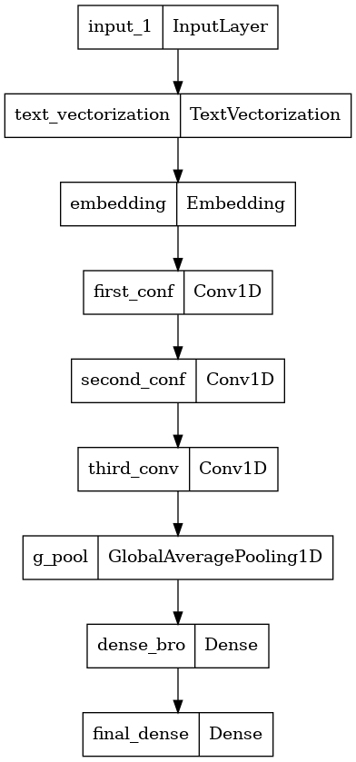
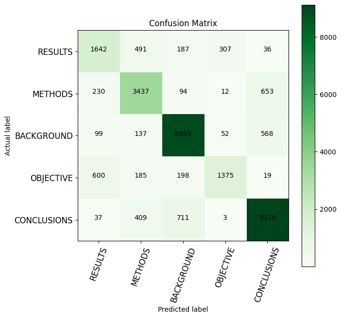
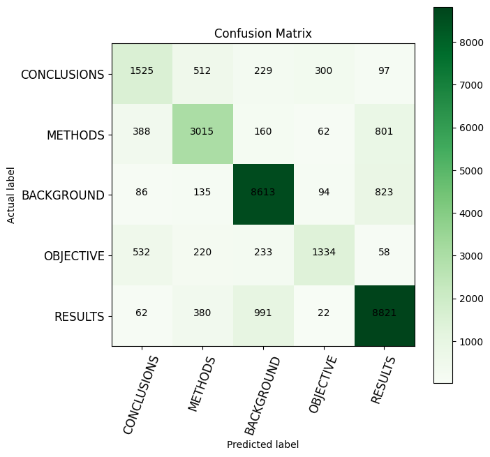

# PubMed 200k RCT - Medical Abstracts Sentence Classification

**Author:** Sevendi Eldrige Rifki Poluan

## Project Overview

This project focuses on classifying sentences in medical abstracts using NLP. The goal is to automatically categorize each sentence in PubMed abstracts into predefined categories—an important task for extracting structured information from biomedical literature.

## Dataset

The project uses the **PubMed 200k RCT dataset**, which contains ~200,000 labeled abstracts from Randomized Controlled Trials. This dataset comes from the paper ["PubMed 200k RCT: a Dataset for Sequential Sentence Classification in Medical Abstracts"](https://arxiv.org/abs/1710.06071) (2017). Each sentence is labeled with its role in the abstract (background, objective, methods, results, conclusions, etc.).

## Approach

The project explores two text representation techniques implemented in the notebook:

### 1. **Word-Level Tokenization**
- Words are converted to unique token IDs using TensorFlow's `TextVectorization` layer
- Captures semantic relationships between words through embeddings
- Effective for understanding overall sentence meaning in medical text

### 2. **Character-Level Tokenization**
- Individual characters are mapped to unique identifiers
- Useful for capturing morphological patterns and handling rare medical terms
- More robust to variations in biomedical language and medical terminology

Both approaches are implemented with neural models optimized for sequence classification using TensorFlow/Keras.

## Model Architecture

The notebook implements neural network models with the following components:

- **Input Layer**: Text vectorization layer processing raw text data
- **Embedding Layer**: Converts tokens to dense vector representations
- **LSTM/Dense Layers**: Sequential processing and feature extraction
- **Global Average Pooling**: Dimension reduction
- **Dense Layers**: Non-linear transformation (128 units with ReLU activation)
- **Output Layer**: Softmax activation for multi-class classification

### Key Training Features:
- **Learning Rate Reduction**: Monitors loss and reduces learning rate by factor of 0.2 after 2 epochs without improvement
- **Early Stopping**: Prevents overfitting by stopping training after 2 epochs without improvement
- **Model Checkpointing**: Saves best model based on training loss
- **Metrics**: Sparse Categorical Accuracy for performance tracking

## Results & Evaluation

### Model Performance Comparison

| Model | Testing Accuracy | Description |
|-------|-----------------|---|
| **Word-Level** | **85.21%** | Converts words to unique token IDs with semantic embeddings |
| **Character-Level** | **82.95%** | Maps individual characters to IDs, captures morphological patterns |
| **Pre-trained Embedding** | **79.03%** | Uses Universal Sentence Encoder from TensorFlow Hub |

The word-level tokenization approach achieves the highest accuracy (85.21%), demonstrating that word-level representations are more effective for sentence classification in medical abstracts compared to character-level and pre-trained embedding approaches.

### Model Architecture

Neural network structure used for word-level text classification showing input layer, embedding, LSTM processing, and output layers.

### Confusion Matrices

#### Word-Level Model (85.21% Accuracy)

Best performing model - accurately classifies sentence categories with high precision across all classes.

#### Character-Level Model (82.95% Accuracy)

Character-level approach shows good performance, useful for handling rare medical terms and morphological variations.

#### Pre-trained Embedding Model (79.03% Accuracy)

Universal Sentence Encoder approach - lowest accuracy among the three, suggesting that task-specific word-level training outperforms general-purpose embeddings for this domain.

## Pre-trained Embeddings

The project also demonstrates the use of **Universal Sentence Encoder** from TensorFlow Hub, which provides pre-trained embeddings trained on larger datasets. This approach:
- Eliminates the need for custom TextVectorization layers
- Provides faster convergence due to better initialized embeddings
- Delivers more effective feature representations for medical text

## Implementation Details

For a detailed walkthrough of the implementation, refer to the [PubMed200kRCT_medical_abstracts.ipynb](PubMed200kRCT_medical_abstracts.ipynb) notebook which includes:
- Data loading and preprocessing steps
- Complete model architecture definitions
- Training procedures with callbacks
- Model evaluation and visualization
- Performance comparisons between approaches
 
